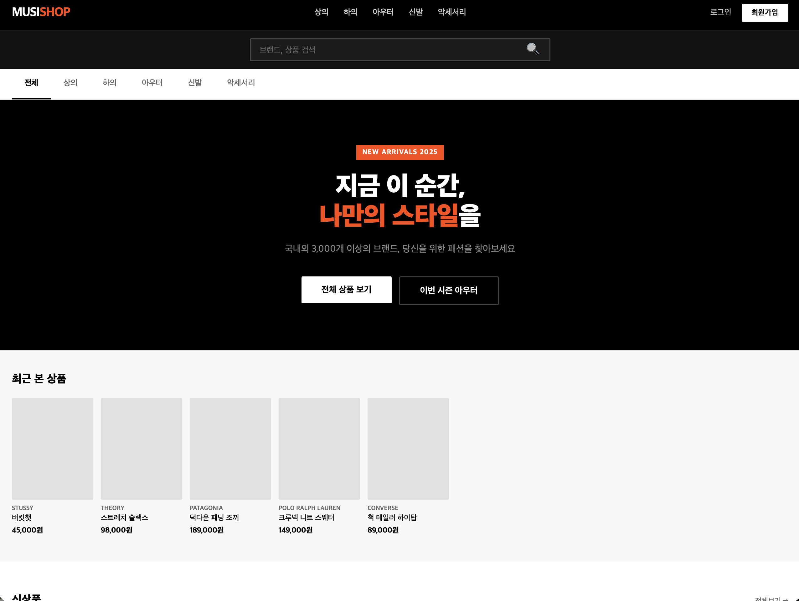
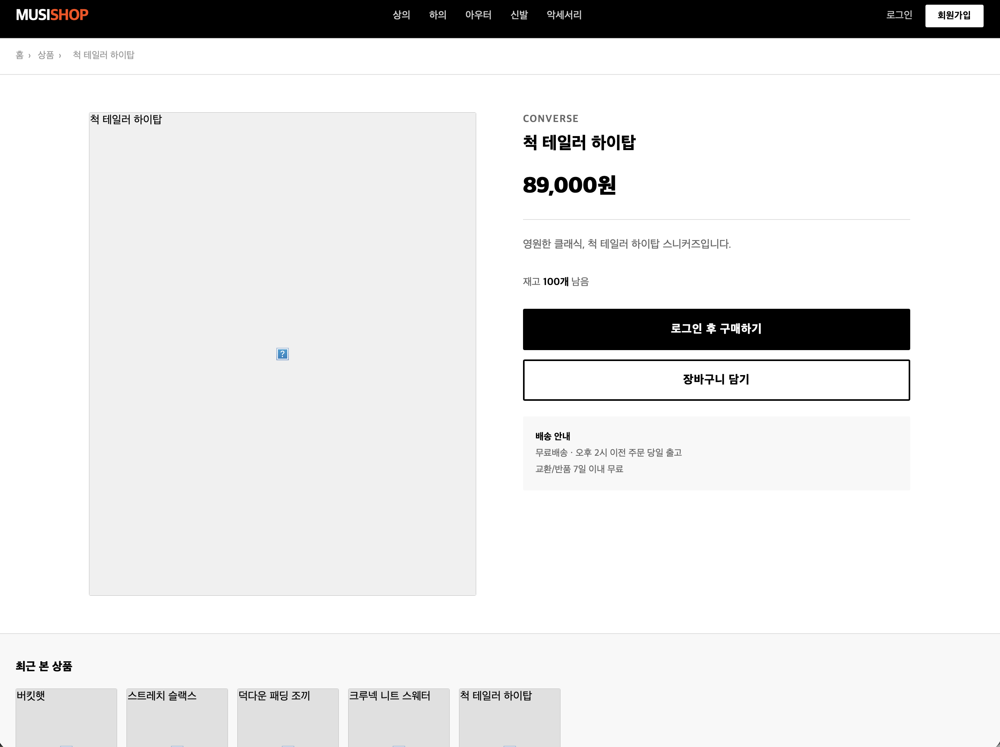

# MUSISHOP 프로젝트 기획서

> 무신사 스타일 패션 쇼핑몰 웹 서비스



---

## 1. 프로젝트 개요

| 항목 | 내용 |
|------|------|
| 프로젝트명 | MUSISHOP |
| 서비스 유형 | 패션 이커머스 웹 서비스 |
| 컨셉 | 무신사(MUSINSA) 스타일의 스트릿 패션 쇼핑몰 |
| 개발 언어 | Java 21 |
| 프레임워크 | Spring Boot 4.0.1 |
| 데이터베이스 | H2 (In-Memory) |
| 템플릿 엔진 | Thymeleaf |
| 빌드 도구 | Maven |

---

## 2. 기술 스택

### Backend
- **Java 21** — LTS 버전, Virtual Thread 지원
- **Spring Boot 4.0.1**
    - Spring Web (MVC)
    - Spring Data JPA
    - Spring Validation
- **H2 Database** — 개발/테스트용 인메모리 DB (`/h2-console` 접근 가능)
- **Lombok** — 보일러플레이트 코드 제거

### Frontend
- **Thymeleaf** — 서버사이드 렌더링
- **Vanilla CSS** — 무신사 스타일 다크 테마
- **Vanilla JS** — 토스트 알림, 로그인 인터셉트

---

## 3. 프로젝트 구조

```
src/main/java/com/shop/
├── MusinsaShopApplication.java     # 메인 진입점
├── entity/
│   ├── Member.java                 # 회원 엔티티
│   └── Product.java                # 상품 엔티티
├── repository/
│   ├── MemberRepository.java
│   └── ProductRepository.java
├── service/
│   ├── MemberService.java
│   └── ProductService.java
├── controller/
│   ├── HomeController.java         # 메인 홈 (/)
│   ├── AuthController.java         # 로그인/회원가입 (/auth/**)
│   ├── ProductController.java      # 상품 목록/상세 (/products/**)
│   └── AdminController.java        # 상품 관리 (/admin/**)
├── dto/
│   ├── MemberDto.java
│   └── ProductDto.java
└── config/
    ├── WebMvcConfig.java           # MVC 설정, 인터셉터 등록
    ├── LoginInterceptor.java       # 로그인 필요 경로 보호
    ├── CookieUtil.java             # 최근 본 상품 쿠키 처리
    ├── H2ConsoleConfig.java        # H2 콘솔 iframe 허용 필터
    └── DataInitializer.java        # 샘플 데이터 초기 적재

src/main/resources/
├── application.yml
├── static/
│   ├── css/style.css
│   └── js/main.js
└── templates/
    ├── index.html                  # 메인 홈
    ├── auth/
    │   ├── login.html
    │   └── register.html
    ├── product/
    │   ├── list.html
    │   ├── detail.html
    │   └── buy.html
    └── admin/
        ├── index.html
        └── product-form.html
```

---

## 4. 데이터 모델

### Member (회원)

| 컬럼 | 타입 | 설명 |
|------|------|------|
| id | Long (PK) | 자동 증가 |
| email | String (UNIQUE) | 이메일 (로그인 ID) |
| role | String | USER / ADMIN |
| createdAt | LocalDateTime | 가입일시 |

### Product (상품)

| 컬럼 | 타입 | 설명 |
|------|------|------|
| id | Long (PK) | 자동 증가 |
| name | String | 상품명 |
| brand | String | 브랜드명 |
| price | Integer | 가격 (원) |
| description | String | 상품 설명 |
| imageUrl | String | 이미지 URL |
| category | String | TOP / BOTTOM / OUTER / SHOES / ACC |
| stock | Integer | 재고 수량 |
| createdAt | LocalDateTime | 등록일시 |

---

## 5. 핵심 기능

### 5-1. 회원 시스템

- **회원가입**: 이메일 하나만 입력하면 즉시 가입 완료 (비밀번호 없음)
- **로그인**: 가입된 이메일 입력으로 로그인, 세션에 이메일과 role 저장
- **로그아웃**: 세션 무효화

```
POST /auth/register  — 이메일 입력 → 회원가입 & 자동 로그인
POST /auth/login     — 이메일 입력 → 로그인
GET  /auth/logout    — 세션 종료
```

### 5-2. 로그인 강제 (LoginInterceptor)

보호 경로에 비로그인 상태로 접근하면 로그인 페이지로 리다이렉트하고, 페이지에서 토스트 알림(`🔒 로그인이 필요한 서비스입니다`)을 표시한다.

**보호 경로**

| 경로 | 설명 |
|------|------|
| `/products/*/buy` | 상품 구매 |
| `/cart/**` | 장바구니 |
| `/mypage/**` | 마이페이지 |
| `/admin/**` | 관리자 |

**제외 경로**: `/auth/**`, `/`, `/products`, `/products/*`, 정적 파일

### 5-3. 최근 본 상품 (Cookie 기반)

상품 상세 페이지 진입 시 해당 상품 ID를 쿠키에 기록하고, 홈·목록·상세 페이지 하단에 최근 본 순서대로 노출한다.

**구현 방식**

```
쿠키명: recentViewed
형식:   URL 인코딩된 문자열, 파이프(|)로 ID 구분  →  예) 3%7C1%7C5
최대:   8개 (초과 시 가장 오래된 항목 제거)
유효기간: 7일
```

> 콤마(`,`)는 쿠키 값으로 허용되지 않는 문자(RFC 6265)이므로 파이프(`|`) 구분자와 URL 인코딩을 함께 사용한다.

**CookieUtil 핵심 로직**

```java
// 저장: ID 목록을 | 로 join 후 URLEncoder로 인코딩
String encoded = URLEncoder.encode(String.join("|", ids), StandardCharsets.UTF_8);

// 읽기: URLDecoder 후 | 로 split
String decoded = URLDecoder.decode(cookie.getValue(), StandardCharsets.UTF_8);
String[] ids = decoded.split("\\|");
```

### 5-4. 상품 관리 (Admin)

관리자 계정(`admin@shop.com`)으로 로그인하면 상단 nav에 관리자 메뉴가 표시된다.

| 기능 | 경로 |
|------|------|
| 상품 목록 조회 | GET `/admin` |
| 상품 추가 폼 | GET `/admin/products/new` |
| 상품 등록 | POST `/admin/products/new` |
| 상품 삭제 | POST `/admin/products/{id}/delete` |

### 5-5. 상품 탐색

| 기능 | 경로 | 설명 |
|------|------|------|
| 전체 목록 | GET `/products` | 최신순 정렬 |
| 카테고리 필터 | GET `/products?category=TOP` | TOP / BOTTOM / OUTER / SHOES / ACC |
| 키워드 검색 | GET `/products?keyword=티셔츠` | 상품명 부분 검색 |
| 상품 상세 | GET `/products/{id}` | 상세 정보 + 최근 본 상품 갱신 |
| 구매 페이지 | GET `/products/{id}/buy` | 로그인 필요 |

---

## 6. 화면 목록

| 화면 | URL | 설명 |
|------|-----|------|
| 메인 홈 | `/` | 히어로 배너, 신상품 8개, 최근 본 상품 |
| 상품 목록 | `/products` | 카테고리·검색 필터, 최근 본 상품 |
| 상품 상세 | `/products/{id}` | 상품 정보, 구매/장바구니 버튼, 최근 본 상품 |
| 구매 페이지 | `/products/{id}/buy` | 배송지 입력, 주문 금액 확인 |
| 로그인 | `/auth/login` | 이메일 입력 |
| 회원가입 | `/auth/register` | 이메일 입력 |
| 관리자 홈 | `/admin` | 전체 상품 테이블, 삭제 |
| 상품 추가 | `/admin/products/new` | 상품 등록 폼 |
| H2 콘솔 | `/h2-console` | DB 직접 조회 (개발용) |

---

## 7. 디자인 시스템

무신사의 블랙 & 화이트 베이스에 오렌지 레드 포인트 컬러를 적용한 스트릿 패션 무드.

### 컬러 팔레트

| 변수 | 값 | 용도 |
|------|-----|------|
| `--black` | `#000000` | 주 배경, 버튼 |
| `--white` | `#ffffff` | 텍스트, 카드 배경 |
| `--accent` | `#ff4800` | 포인트 컬러, 로고, 배지 |
| `--gray-50` | `#f8f8f8` | 섹션 배경 |
| `--gray-200` | `#e0e0e0` | 테두리 |
| `--gray-600` | `#666666` | 보조 텍스트 |

### 주요 UI 패턴

- **Sticky 네비게이션**: 검정 배경, 스크롤 시 상단 고정
- **상품 카드**: 4:5 비율 이미지, 호버 시 줌 효과
- **토스트 알림**: 하단 중앙, 슬라이드업 애니메이션
- **최근 본 상품**: 가로 스크롤 리스트

---

## 8. 보안 및 설정

### 세션 기반 인증

Spring Security를 사용하지 않고 `HttpSession`으로 간단하게 구현.

```java
// 로그인 성공 시
session.setAttribute("loginEmail", member.getEmail());
session.setAttribute("loginRole", member.getRole());

// 인터셉터에서 검증
HttpSession session = request.getSession(false);
if (session == null || session.getAttribute("loginEmail") == null) {
    response.sendRedirect("/auth/login?alert=login");
}
```

### H2 콘솔 접근 허용

H2 콘솔은 내부적으로 `<iframe>` 구조를 사용하는데, 브라우저의 `X-Frame-Options` 헤더 차단으로 렌더링이 막힐 수 있어 필터로 해제.

```yaml
spring:
  h2:
    console:
      enabled: true
      path: /h2-console
      settings:
        web-allow-others: true
```

```java
// H2ConsoleConfig.java — /h2-console/* 경로에 SAMEORIGIN 헤더 적용
res.setHeader("X-Frame-Options", "SAMEORIGIN");
```

---

## 9. 초기 데이터

서버 시작 시 `DataInitializer`가 자동 실행되어 아래 데이터를 적재한다.

### 기본 계정

| 이메일 | 권한 | 설명 |
|--------|------|------|
| `admin@shop.com` | ADMIN | 관리자 계정 |

### 샘플 상품 (12개)

| 상품명 | 브랜드 | 카테고리 | 가격 |
|--------|--------|----------|------|
| 오버사이즈 무지 티셔츠 | MUSINSA STANDARD | TOP | 29,000원 |
| 워싱 데님 팬츠 | MUSINSA STANDARD | BOTTOM | 59,000원 |
| 코튼 후드 집업 | COVERNAT | TOP | 89,000원 |
| 와이드 카고 팬츠 | CARHARTT | BOTTOM | 129,000원 |
| 울 체크 오버코트 | WOOL&THE GANG | OUTER | 259,000원 |
| 레더 로우탑 스니커즈 | NEW BALANCE | SHOES | 119,000원 |
| 미니멀 캔버스 토트백 | STANDARD SUPPLY | ACC | 49,000원 |
| 스트레치 슬랙스 | THEORY | BOTTOM | 98,000원 |
| 덕다운 패딩 조끼 | PATAGONIA | OUTER | 189,000원 |
| 크루넥 니트 스웨터 | POLO RALPH LAUREN | TOP | 149,000원 |
| 척 테일러 하이탑 | CONVERSE | SHOES | 89,000원 |
| 버킷햇 | STUSSY | ACC | 45,000원 |

---

## 10. 실행 방법

### 요구사항

- Java 21 이상
- Maven 3.x 이상

### 실행

```bash
# 프로젝트 루트에서
./mvnw spring-boot:run

# 또는
mvn spring-boot:run
```

### 접속

| URL | 설명 |
|-----|------|
| `http://localhost:8080` | 메인 쇼핑몰 |
| `http://localhost:8080/h2-console` | DB 콘솔 |

### H2 콘솔 접속 정보

```
JDBC URL: jdbc:h2:mem:shopdb
User:     sa
Password: (빈 칸)
```

---

## 11. 알려진 이슈 및 해결 내역

### 쿠키 콤마 오류 (해결됨)

**증상**: 두 번째 상품부터 상세 페이지 진입 시 `IllegalArgumentException: An invalid character [44] was present in the Cookie value` 오류 발생.

**원인**: HTTP 쿠키 스펙(RFC 6265)에서 콤마(`,`, ASCII 44)는 허용되지 않는 특수문자.

**해결**: 구분자를 콤마 → 파이프(`|`)로 변경하고, 쿠키 값 전체를 URL 인코딩/디코딩 처리.

### H2 콘솔 접근 불가 (해결됨)

**증상**: `/h2-console` 접속 시 빈 화면이거나 페이지가 열리지 않음.

**원인**: H2 콘솔은 내부적으로 `<iframe>` 구조를 사용하는데, 브라우저가 `X-Frame-Options: DENY` 헤더를 받으면 iframe 렌더링을 차단함.

**해결**: `H2ConsoleConfig.java` 필터를 추가해 `/h2-console/*` 경로에 `X-Frame-Options: SAMEORIGIN` 헤더를 주입하고, `application.yml`에 `web-allow-others: true` 설정 추가.

---

*MUSISHOP 프로젝트 기획서 v1.0 — 2025*